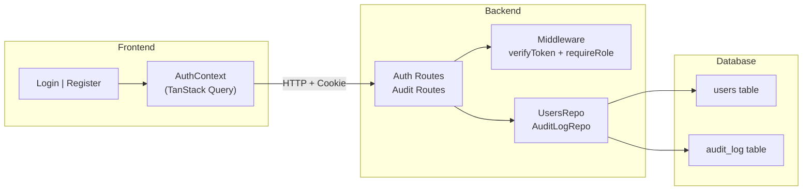

# Application Design — Autenticación Persistente OctoCAT Supply

## Executive Summary

This document consolidates the application design for adding real persistent authentication to OctoCAT Supply. The design replaces the existing client-side mock with JWT-based authentication using httpOnly cookies, bcrypt password hashing, and login audit logging.

**Design Decisions (from user input):**
- Route-level orchestration (no service layer) — consistent with existing patterns
- Separate validators utility module — reusable, testable in isolation
- Expanded middleware directory for auth concerns — separate files for `verifyToken` and `requireRole`
- TanStack Query for frontend session management — leverages existing dependency
- Standalone Register component with dedicated route
- Composable `requireRole()` middleware for access control
- `cookie-parser` NPM package for cookie handling

---

## Architecture Overview



---

## Components (16 total)

| # | Component | Type | Status | Package |
|---|-----------|------|--------|---------|
| 1 | Auth Routes | Route Handler | New | api |
| 2 | Audit Log Routes | Route Handler | New | api |
| 3 | UsersRepository | Repository | New | api |
| 4 | AuditLogRepository | Repository | New | api |
| 5 | verifyToken | Middleware | New | api |
| 6 | requireRole | Middleware Factory | New | api |
| 7 | Validators | Utility | New | api |
| 8 | AuthContext | React Context | Refactored | frontend |
| 9 | Login | Page Component | Refactored | frontend |
| 10 | Register | Page Component | New | frontend |
| 11 | Navigation | Component | Minor mod | frontend |
| 12 | App | Router | Minor mod | frontend |
| 13 | index.ts | Entry point | Minor mod | api |
| 14 | 003_create_users.sql | Migration | New | api |
| 15 | 004_create_audit_log.sql | Migration | New | api |
| 16 | 005_users.sql | Seed | New | api |

**Details**: See [components.md](./components.md)

---

## Key Method Signatures

### Backend

```typescript
// UsersRepository
async create(user: CreateUserInput): Promise<UserPublic>
async findByEmail(email: string): Promise<UserWithHash | null>
async findByEmailPublic(email: string): Promise<UserPublic | null>

// AuditLogRepository
async insertLoginEvent(entry: AuditLogEntry): Promise<void>
async findAll(options: PaginationOptions): Promise<PaginatedResult<AuditLogRecord>>

// Middleware
function verifyToken(req, res, next): void
function requireRole(...roles: string[]): Middleware

// Validators
function validateEmail(email: string): string | null
function validatePassword(password: string): string[] | null
function validateRegistrationInput(input): Record<string, string> | null
```

### Frontend

```typescript
interface AuthContextType {
  user: AuthUser | null;
  isLoggedIn: boolean;
  isAdmin: boolean;
  isLoading: boolean;
  login: (email: string, password: string) => Promise<void>;
  register: (data: RegisterData) => Promise<void>;
  logout: () => Promise<void>;
}
```

**Details**: See [component-methods.md](./component-methods.md)

---

## Orchestration Pattern

**No service layer** — route handlers orchestrate directly (consistent with existing codebase):

| Flow | Steps |
|------|-------|
| Register | validate → check duplicate → hash → store → respond 201 |
| Login | validate → find user → compare hash → sign JWT → set cookie → audit → respond 200 |
| Session | middleware verifyToken → find user public → respond 200 |
| Logout | clear cookie → respond 200 |
| Audit query | verifyToken → requireRole → paginate → respond 200 |

**Details**: See [services.md](./services.md)

---

## Dependency Summary

### New NPM Packages (API)

| Package | Purpose |
|---------|---------|
| `bcryptjs` | Password hashing |
| `jsonwebtoken` | JWT sign/verify |
| `cookie-parser` | Cookie parsing |

### New Environment Variables

| Variable | Purpose |
|----------|---------|
| `JWT_SECRET` | HMAC signing key |
| `JWT_EXPIRY` | Token TTL (default: 1h) |

### Middleware Chain

```
cors → json → cookieParser → requestLogger → [verifyToken] → [requireRole] → handler → errorHandler
```

**Details**: See [component-dependency.md](./component-dependency.md)

---

## File Structure (New/Modified)

```
api/
├── database/
│   ├── migrations/
│   │   ├── 003_create_users.sql          (NEW)
│   │   └── 004_create_audit_log.sql      (NEW)
│   ├── migrations-pg/
│   │   ├── 003_create_users.sql          (NEW)
│   │   └── 004_create_audit_log.sql      (NEW)
│   └── seed/
│       └── 005_users.sql                 (NEW)
├── src/
│   ├── index.ts                          (MODIFIED — register routes, add cookie-parser)
│   ├── middleware/
│   │   └── auth/
│   │       ├── verifyToken.ts            (NEW)
│   │       └── requireRole.ts            (NEW)
│   ├── models/
│   │   ├── user.ts                       (NEW)
│   │   └── auditLog.ts                   (NEW)
│   ├── repositories/
│   │   ├── usersRepo.ts                  (NEW)
│   │   └── auditLogRepo.ts              (NEW)
│   ├── routes/
│   │   ├── auth.ts                       (NEW)
│   │   └── auditLog.ts                   (NEW)
│   └── utils/
│       └── validators.ts                 (NEW)
└── package.json                          (MODIFIED — add dependencies)

frontend/
├── src/
│   ├── App.tsx                           (MODIFIED — add /register route)
│   ├── context/
│   │   └── AuthContext.tsx               (MODIFIED — full refactoring)
│   └── components/
│       ├── Login.tsx                     (MODIFIED — wire to real API)
│       ├── Register.tsx                  (NEW)
│       └── Navigation.tsx               (MODIFIED — show user name)
```

---

## Extension Compliance

| Gate | Status | Evidence |
|------|--------|----------|
| Gate 1 — Audit Immutable | Compliant | `audit_log` table (append-only), login events recorded |
| Gate 2 — Auth Real | Compliant | JWT + bcrypt, no mock |
| Gate 3 — No SQL Concat | Compliant | All queries use parameterized placeholders |

---

## Design Constraints & Boundaries

- **No existing endpoints modified** — auth is additive only
- **No existing tables altered** — new migrations only
- **No breaking changes** — existing functionality untouched
- **Single unit of work** — API + Frontend delivered together
- **Update sequence**: API first (foundation), then Frontend (integration)
