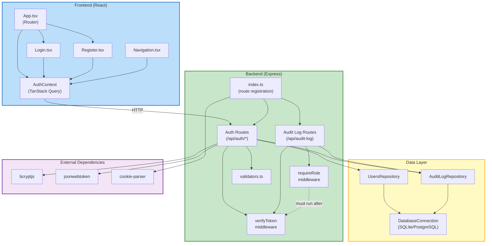

# Component Dependencies — Autenticación Persistente

## Dependency Matrix

| Component | Depends On | Depended On By |
|-----------|-----------|----------------|
| Auth Routes | UsersRepo, AuditLogRepo, validators, bcrypt, jsonwebtoken, cookie-parser | API index.ts (registration) |
| Audit Log Routes | AuditLogRepo, verifyToken, requireRole | API index.ts (registration) |
| UsersRepository | DatabaseConnection, sql utils, User model | Auth Routes |
| AuditLogRepository | DatabaseConnection, sql utils, AuditLog model | Auth Routes, Audit Log Routes |
| verifyToken middleware | jsonwebtoken, JWT_SECRET env var | Auth Routes (me), Audit Log Routes |
| requireRole middleware | verifyToken (must run first) | Audit Log Routes |
| Validators utility | (none — pure functions) | Auth Routes |
| Frontend AuthContext | Axios, TanStack Query, API endpoints | Login, Register, Navigation, App |
| Login component | AuthContext | App (routing) |
| Register component | AuthContext | App (routing) |

---

## Dependency Diagram



---

## Communication Patterns

### Frontend → Backend

| Communication | Protocol | Details |
|--------------|----------|---------|
| AuthContext → Auth Routes | HTTP REST | Axios with `withCredentials: true` (cookies auto-sent) |
| Cookie-based session | httpOnly Cookie | Browser manages automatically; no manual token handling |

### Backend Internal

| Communication | Pattern | Details |
|--------------|---------|---------|
| Routes → Repositories | Direct method call | Sync dependency injection (`new UsersRepository(db)`) |
| Routes → Validators | Direct function call | Import pure functions from utils |
| Middleware → Routes | Express middleware chain | `verifyToken` attaches `req.user`, next handler reads it |
| requireRole → verifyToken | Implicit ordering | `requireRole` expects `req.user` to exist (set by `verifyToken`) |

### Data Flow (Auth Request)

```
Browser                Frontend              API                    Database
  |                      |                    |                       |
  |-- Click Login ------>|                    |                       |
  |                      |-- POST /auth/login ->                      |
  |                      |                    |-- findByEmail -------->|
  |                      |                    |<-- user + hash --------|
  |                      |                    |-- bcrypt.compare       |
  |                      |                    |-- jwt.sign             |
  |                      |                    |-- insertLoginEvent --->|
  |                      |<-- 200 + Set-Cookie-|                       |
  |<-- Render dashboard--|                    |                       |
  |                      |                    |                       |
  |-- Navigate page ---->|                    |                       |
  |                      |-- GET /auth/me ---->|                       |
  |                      |    (cookie auto)   |-- verify JWT          |
  |                      |                    |-- findByEmailPublic -->|
  |                      |<-- 200 user data ---|<-- user data ---------|
  |<-- Show user name ---|                    |                       |
```

---

## New NPM Dependencies

### API (`api/package.json`)

| Package | Purpose | Pinned Version |
|---------|---------|----------------|
| `bcryptjs` | Password hashing (pure JS, no native compilation) | ^2.4.3 |
| `jsonwebtoken` | JWT sign/verify | ^9.0.2 |
| `cookie-parser` | Parse cookies from request headers | ^1.4.6 |
| `@types/bcryptjs` | TypeScript types | ^2.4.6 |
| `@types/jsonwebtoken` | TypeScript types | ^9.0.7 |
| `@types/cookie-parser` | TypeScript types | ^1.4.7 |

### Frontend (`frontend/package.json`)

No new dependencies — TanStack Query and Axios already exist in the project.

---

## Environment Variables (New)

| Variable | Required | Default | Purpose |
|----------|----------|---------|---------|
| `JWT_SECRET` | Yes (production) | `dev-secret-change-in-production` | HMAC key for JWT signing |
| `JWT_EXPIRY` | No | `1h` | Token expiration time |

---

## Middleware Chain Order

```
Request
  → cors()
  → express.json()
  → cookieParser()
  → requestLogger()
  → [route-specific middleware]
      → verifyToken (if protected route)
      → requireRole('admin') (if admin-only)
  → route handler
  → errorHandler (catch-all)
Response
```
