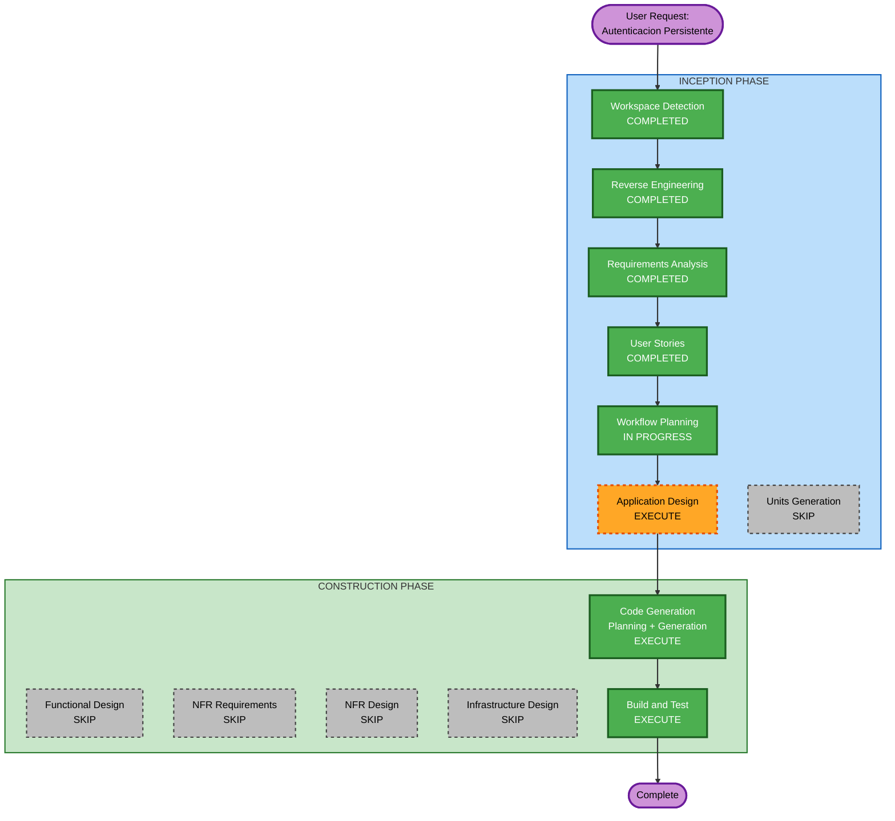

# Execution Plan

## Detailed Analysis Summary

### Transformation Scope (Brownfield)
- **Transformation Type**: Single module addition (authentication) across two existing packages
- **Primary Changes**: New auth module in API (routes, repository, middleware, model, migrations) + AuthContext refactoring in Frontend
- **Related Components**: API routes registration (index.ts), Frontend context layer, Database migration system

### Change Impact Assessment
- **User-facing changes**: Yes — New login/register UI, persistent session, user name display in header
- **Structural changes**: No — Uses existing patterns (repository, routes, context). No architectural transformation needed.
- **Data model changes**: Yes — Two new tables: `users` (auth data) and `audit_log` (login events)
- **API changes**: Yes — Four new endpoints (`POST /api/auth/register`, `POST /api/auth/login`, `POST /api/auth/logout`, `GET /api/auth/me`), one new endpoint (`GET /api/audit-log`)
- **NFR impact**: Yes — Security (bcrypt, JWT, httpOnly cookies), but implementation follows standard well-known patterns

### Component Relationships (Brownfield)

```
## Component Relationships
- Primary Component: api/src/routes/auth.ts (new), api/src/repositories/usersRepo.ts (new)
- Infrastructure Components: api/database/migrations/ (new migration files)
- Shared Components: api/src/models/ (new User interface), api/src/db/ (existing, no changes)
- Dependent Components: frontend/src/context/AuthContext.tsx (refactoring), frontend/src/components/Login.tsx (refactoring)
- Supporting Components: api/src/middleware/ (new auth middleware for JWT verification)
```

| Related Component | Change Type | Change Reason | Priority |
|---|---|---|---|
| api/src/routes/auth.ts | Major (new file) | Auth endpoints | Critical |
| api/src/repositories/usersRepo.ts | Major (new file) | User data access | Critical |
| api/src/repositories/auditLogRepo.ts | Major (new file) | Audit logging | Critical |
| api/src/middleware/authMiddleware.ts | Major (new file) | JWT verification | Critical |
| api/src/models/user.ts | Minor (new file) | User interface | Critical |
| api/src/models/auditLog.ts | Minor (new file) | AuditLog interface | Critical |
| api/database/migrations/003_create_users.sql | Major (new file) | Users table | Critical |
| api/database/migrations/004_create_audit_log.sql | Major (new file) | Audit table | Critical |
| api/database/migrations-pg/003_create_users.sql | Major (new file) | PG users table | Critical |
| api/database/migrations-pg/004_create_audit_log.sql | Major (new file) | PG audit table | Critical |
| api/database/seed/005_users.sql | Minor (new file) | Dev seed users | Important |
| api/src/index.ts | Minor (modification) | Register auth routes | Critical |
| api/package.json | Minor (modification) | Add bcrypt, jsonwebtoken deps | Critical |
| frontend/src/context/AuthContext.tsx | Major (refactoring) | Replace mock with real auth | Critical |
| frontend/src/components/Login.tsx | Major (refactoring) | Real login form | Critical |
| frontend/src/components/Register.tsx | Major (new file) | Registration page | Important |
| frontend/src/components/Navigation.tsx | Minor (modification) | Display user name | Important |
| frontend/src/App.tsx | Minor (modification) | Add register route | Important |

### Risk Assessment
- **Risk Level**: Medium
- **Rationale**: Multiple components across 2 packages, but all changes follow existing patterns. Auth is a well-understood domain. No existing endpoints are modified.
- **Rollback Complexity**: Easy — New files can be removed, migrations can be rolled back, AuthContext can be reverted
- **Testing Complexity**: Moderate — Requires integration tests covering full auth flow (register → login → session → logout)

---

## Workflow Visualization



### Text Alternative
```
Phase 1: INCEPTION
  - Stage 1: Workspace Detection (COMPLETED)
  - Stage 2: Reverse Engineering (COMPLETED)
  - Stage 3: Requirements Analysis (COMPLETED)
  - Stage 4: User Stories (COMPLETED)
  - Stage 5: Workflow Planning (IN PROGRESS)
  - Stage 6: Application Design (EXECUTE)
  - Stage 7: Units Generation (SKIP)

Phase 2: CONSTRUCTION
  - Stage 8: Functional Design (SKIP)
  - Stage 9: NFR Requirements (SKIP)
  - Stage 10: NFR Design (SKIP)
  - Stage 11: Infrastructure Design (SKIP)
  - Stage 12: Code Generation (EXECUTE)
  - Stage 13: Build and Test (EXECUTE)
```

---

## Phases to Execute

### INCEPTION PHASE
- [x] Workspace Detection (COMPLETED)
- [x] Reverse Engineering (COMPLETED)
- [x] Requirements Analysis (COMPLETED)
- [x] User Stories (COMPLETED)
- [x] Workflow Planning (IN PROGRESS)
- [ ] Application Design - **EXECUTE**
  - **Rationale**: New auth module introduces new components (auth routes, users repository, audit log repository, auth middleware). Component methods, responsibilities, and interactions need clear definition before code generation. This ensures the auth module integrates cleanly with the existing codebase patterns.
- [ ] Units Generation - **SKIP**
  - **Rationale**: The feature is a single cohesive unit — "Authentication Module". It cannot be meaningfully decomposed into separately deployable units. Both API and Frontend changes are tightly coupled and must be delivered together.

### CONSTRUCTION PHASE
- [ ] Functional Design - **SKIP**
  - **Rationale**: Business rules are fully specified in requirements (REQ-FR-01 through REQ-FR-08) and user stories (22 acceptance criteria). No additional data model design or complex business logic requiring detailed functional design beyond what Application Design will cover.
- [ ] NFR Requirements - **SKIP**
  - **Rationale**: Non-functional requirements are already comprehensively defined (REQ-NFR-01 through REQ-NFR-08). No additional NFR discovery needed.
- [ ] NFR Design - **SKIP**
  - **Rationale**: Security patterns (bcrypt hashing, JWT signing, httpOnly cookies) are standard implementations with well-known patterns. No complex NFR design decisions needed beyond what's already specified.
- [ ] Infrastructure Design - **SKIP**
  - **Rationale**: No infrastructure changes required. The auth module runs within the existing Express.js server and Docker deployment. No new cloud services, containers, or networking changes needed.
- [ ] Code Generation - **EXECUTE** (ALWAYS)
  - **Rationale**: Implementation of authentication module across API and Frontend. Planning phase will define exact file creation/modification sequence. Generation phase will produce all code artifacts.
- [ ] Build and Test - **EXECUTE** (ALWAYS)
  - **Rationale**: Build verification, unit tests (validation logic, hashing, repository), and integration tests (full auth flow) required to confirm implementation correctness.

### OPERATIONS PHASE
- [ ] Operations - PLACEHOLDER
  - **Rationale**: Future deployment and monitoring workflows — not applicable for this iteration.

---

## Module Update Strategy (Brownfield)

- **Update Approach**: Sequential (API first, then Frontend)
- **Critical Path**: API auth module must be fully functional before Frontend can integrate
- **Coordination Points**: API endpoint contracts (/api/auth/*) are the interface between packages
- **Testing Checkpoints**: API integration tests first, then Frontend E2E tests

### Package Change Sequence

| Order | Package | Changes | Dependency |
|---|---|---|---|
| 1 | api/ (database) | New migrations: `003_create_users.sql`, `004_create_audit_log.sql` | None — foundation for all auth code |
| 2 | api/ (models) | New interfaces: `User`, `AuditLog` | Migrations must exist |
| 3 | api/ (repositories) | New repos: `usersRepo.ts`, `auditLogRepo.ts` | Models + DB layer |
| 4 | api/ (middleware) | New: `authMiddleware.ts` (JWT verification) | User model |
| 5 | api/ (routes) | New: `auth.ts` routes + register in index.ts | Repos + Middleware |
| 6 | api/ (seed) | New: `005_users.sql` with pre-hashed passwords | Users table migration |
| 7 | api/ (tests) | Unit + integration tests for auth flow | Routes working |
| 8 | frontend/ (context) | Refactor `AuthContext.tsx` to use real endpoints | API endpoints working |
| 9 | frontend/ (components) | Refactor `Login.tsx`, new `Register.tsx`, update Nav | AuthContext ready |
| 10 | frontend/ (routing) | Update `App.tsx` for register route | Components ready |

---

## Estimated Timeline
- **Total Stages to Execute**: 3 (Application Design, Code Generation, Build and Test)
- **Total Stages to Skip**: 5 (Units Generation, Functional Design, NFR Requirements, NFR Design, Infrastructure Design)
- **Estimated Interactions**: 5-7 (1 for App Design, 2 for Code Gen planning+execution, 2 for Build and Test)

## Success Criteria
- **Primary Goal**: Replace mock auth with real persistent authentication using JWT + bcrypt
- **Key Deliverables**:
  - Working register/login/logout/session-check endpoints
  - Refactored frontend AuthContext with real API calls
  - Login audit logging (success + failed attempts)
  - Database migrations (users + audit_log tables)
  - Comprehensive test suite (unit + integration)
- **Quality Gates**:
  - Gate 1: audit_log table created, login events recorded (LOGIN_SUCCESS, LOGIN_FAILED)
  - Gate 2: JWT + bcrypt used (no mock auth)
  - Gate 3: All SQL queries use parameterized placeholders
  - TypeScript strict mode compliance (no `any`)
  - All existing tests continue to pass (no breaking changes)
- **Integration Testing**: Auth flow works end-to-end (register → login → session persist → logout)

## Extension Compliance Summary
| Extension | Status | Rationale |
|---|---|---|
| applying-standards (Gate 1 — Audit) | Compliant | Login audit implemented in US-06. Order/Delivery audit deferred (no creation flow exists) |
| applying-standards (Gate 2 — Auth Real) | Compliant | JWT + bcrypt mandatory per REQ-FR-02, REQ-FR-03 |
| applying-standards (Gate 3 — No SQL concat) | Compliant | All SQL uses parameterized queries per REQ-NFR-08 |
| security-baseline | N/A | Opted out by user |
| property-based-testing | N/A | Opted out by user |
| resiliency-baseline | N/A | Opted out by user |
