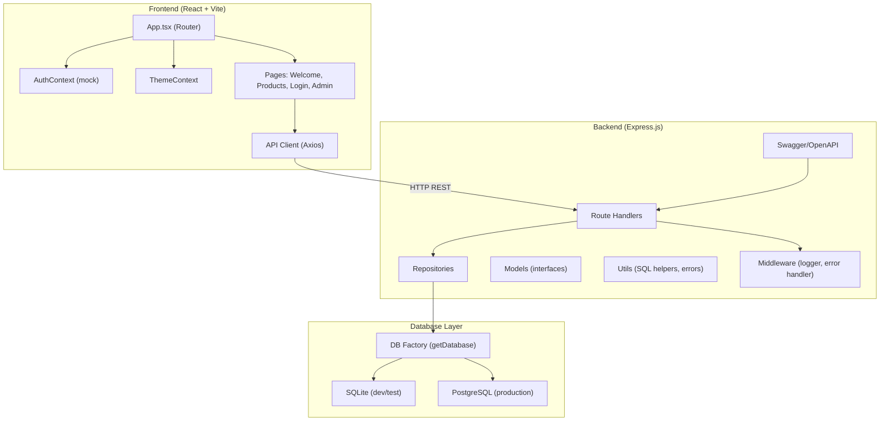
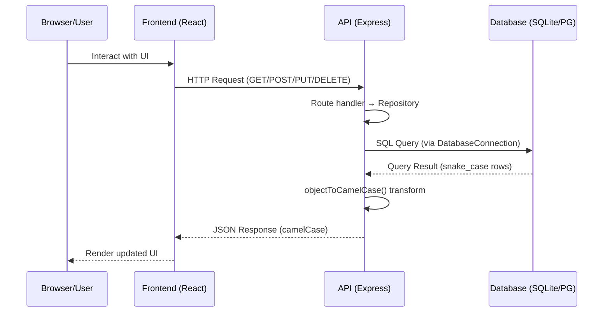

# System Architecture

## System Overview

OctoCAT Supply es una aplicación full-stack de gestión de cadena de suministro compuesta por un backend Express.js (TypeScript) que expone una API REST y un frontend React (TypeScript) con Tailwind CSS. La persistencia de datos usa una abstracción dual: SQLite para desarrollo/testing y PostgreSQL para producción. Ambos componentes se despliegan en contenedores Docker.

## Architecture Diagram

## Component Descriptions

### Frontend (React SPA)
- **Purpose**: Interfaz de usuario para gestión de cadena de suministro
- **Responsibilities**: Routing, renderizado de UI, state management (Context API), llamadas HTTP al backend
- **Dependencies**: React, React Router, TanStack Query, Axios, Tailwind CSS
- **Type**: Application

### API (Express.js Server)
- **Purpose**: Backend REST API que provee operaciones CRUD sobre todas las entidades
- **Responsibilities**: Routing HTTP, validación básica, persistencia via repositorios, documentación OpenAPI, manejo de errores
- **Dependencies**: Express 5, better-sqlite3, pg, swagger-jsdoc/swagger-ui-express, cors
- **Type**: Application

### Database Layer
- **Purpose**: Abstracción de persistencia dual (SQLite/PostgreSQL)
- **Responsibilities**: Conexión, migraciones, seeding, adaptación de placeholders (? → $N)
- **Dependencies**: better-sqlite3, pg
- **Type**: Shared

## Data Flow

## Integration Points

- **External APIs**: Ninguna. El sistema es autocontenido.
- **Databases**: SQLite (archivo local) y PostgreSQL (contenedor Docker)
- **Third-party Services**: Ninguno en producción. Docker para infraestructura.

## Infrastructure Components

- **Docker Compose**: 3 servicios (postgres, api, frontend)
- **Deployment Model**: Contenedores independientes con networking interno Docker
- **Networking**: Red interna Docker. Frontend en nginx proxy reverso. API expone puerto 3000.
- **Volumes**: `pg-data` volumen persistente para PostgreSQL
