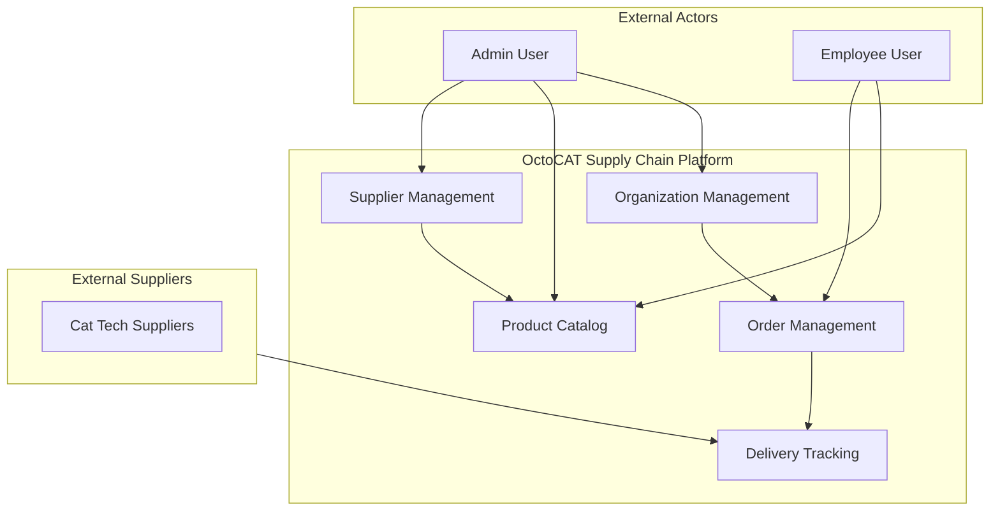

# Business Overview

## Business Context Diagram

## Business Description
- **Business Description**: OctoCAT Supply es una plataforma de gestión de cadena de suministro para una empresa ficticia de productos inteligentes para gatos potenciados por IA. El sistema permite gestionar proveedores, catálogo de productos, órdenes de compra por sucursales, y seguimiento de entregas desde los proveedores.
- **Business Transactions**:
  - **Gestión de Proveedores**: Alta, baja, modificación y verificación de proveedores. Cada proveedor tiene estados `active` y `verified`.
  - **Catálogo de Productos**: CRUD de productos vinculados a proveedores. Incluye precio, SKU, unidad, imagen y descuento.
  - **Gestión de Órdenes**: Las sucursales (branches) crean órdenes. Cada orden tiene líneas de detalle (order details) que referencian productos específicos con cantidad y precio unitario.
  - **Gestión de Entregas**: Los proveedores generan entregas que se vinculan a líneas de detalle de órdenes (cumplimiento parcial). Una entrega puede satisfacer múltiples líneas de órdenes distintas.
  - **Gestión Organizacional**: Headquarters → Branches. La estructura organizacional determina qué sucursales pueden emitir órdenes.
- **Business Dictionary**:
  - **Supplier**: Proveedor externo de productos
  - **Headquarters**: Oficina principal que contiene sucursales
  - **Branch**: Sucursal que emite órdenes de compra
  - **Product**: Artículo disponible para compra
  - **Order**: Pedido emitido por una sucursal
  - **Order Detail**: Línea de detalle dentro de una orden (producto + cantidad + precio)
  - **Delivery**: Envío de cumplimiento desde un proveedor
  - **Order Detail Delivery**: Relación entre una línea de orden y una entrega (cumplimiento parcial)

## Component Level Business Descriptions

### API (Backend)
- **Purpose**: Proveer servicios REST para todas las operaciones de negocio de la cadena de suministro
- **Responsibilities**: CRUD de todas las entidades, persistencia en base de datos, documentación OpenAPI, manejo de errores centralizado

### Frontend (React SPA)
- **Purpose**: Interfaz de usuario para visualizar y gestionar productos, navegar el catálogo, y administrar inventario
- **Responsibilities**: Presentación de datos, formularios de gestión, navegación, tema oscuro/claro, autenticación mock (sin persistencia real)
