# Code Structure

## Build System
- **Type**: npm (monorepo manual — sin workspace linkage)
- **API build**: `tsc` (producción), `tsx` (desarrollo con hot reload)
- **Frontend build**: Vite (con `@vitejs/plugin-react`)
- **Configuration**:
  - `api/package.json` — dependencies, scripts, TypeScript strict
  - `frontend/package.json` — React, Vite, Tailwind, testing libs
  - `Makefile` — comandos convenientes (`make dev`, `make build`, `make test`)

## Key Classes/Modules

```mermaid
graph TD
    subgraph API["api/src/"]
        index["index.ts (Express app)"]
        subgraph Routes["routes/"]
            supplier_r["supplier.ts"]
            product_r["product.ts"]
            order_r["order.ts"]
            orderDetail_r["orderDetail.ts"]
            delivery_r["delivery.ts"]
            headquarters_r["headquarters.ts"]
            branch_r["branch.ts"]
            orderDetailDelivery_r["orderDetailDelivery.ts"]
        end
        subgraph Models["models/"]
            supplier_m["supplier.ts"]
            product_m["product.ts"]
            order_m["order.ts"]
            orderDetail_m["orderDetail.ts"]
            delivery_m["delivery.ts"]
            headquarters_m["headquarters.ts"]
            branch_m["branch.ts"]
            orderDetailDelivery_m["orderDetailDelivery.ts"]
        end
        subgraph Repos["repositories/"]
            suppliersRepo["suppliersRepo.ts"]
            productsRepo["productsRepo.ts"]
            ordersRepo["ordersRepo.ts"]
            orderDetailsRepo["orderDetailsRepo.ts"]
            deliveriesRepo["deliveriesRepo.ts"]
            headquartersRepo["headquartersRepo.ts"]
            branchesRepo["branchesRepo.ts"]
            orderDetailDeliveriesRepo["orderDetailDeliveriesRepo.ts"]
        end
        subgraph DB["db/"]
            db_index["index.ts (factory)"]
            db_sqlite["sqlite.ts"]
            db_postgres["postgres.ts"]
            db_types["types.ts"]
            db_config["config.ts"]
            db_migrate["migrate.ts"]
            db_seed["seed.ts"]
        end
        subgraph Utils["utils/"]
            sql["sql.ts"]
            errors["errors.ts"]
        end
    end
    
    index --> Routes
    Routes --> Repos
    Repos --> DB
    Repos --> Utils
    Routes --> Models
```

### Existing Files Inventory

**API - Core:**
- `api/src/index.ts` — Express app bootstrap, middleware setup, route registration, CORS, Swagger
- `api/src/init-db.ts` — Database initialization script (migrations + optional seed)
- `api/src/swagger-options.ts` — Swagger/OpenAPI configuration
- `api/src/generate-swagger.ts` — Script to export swagger spec to JSON file
- `api/src/seedData.ts` — Programmatic seed data (legacy, replaced by SQL seeds)

**API - Routes:**
- `api/src/routes/supplier.ts` — CRUD + status endpoint for suppliers
- `api/src/routes/product.ts` — CRUD for products
- `api/src/routes/order.ts` — CRUD for orders
- `api/src/routes/orderDetail.ts` — CRUD for order details
- `api/src/routes/delivery.ts` — CRUD + status update for deliveries
- `api/src/routes/headquarters.ts` — CRUD + metrics/label for headquarters
- `api/src/routes/branch.ts` — CRUD for branches
- `api/src/routes/orderDetailDelivery.ts` — CRUD for order-detail-delivery junction

**API - Models:**
- `api/src/models/supplier.ts` — Supplier interface
- `api/src/models/product.ts` — Product interface
- `api/src/models/order.ts` — Order interface
- `api/src/models/orderDetail.ts` — OrderDetail interface
- `api/src/models/delivery.ts` — Delivery interface
- `api/src/models/headquarters.ts` — Headquarters interface
- `api/src/models/branch.ts` — Branch interface
- `api/src/models/orderDetailDelivery.ts` — OrderDetailDelivery interface

**API - Repositories:**
- `api/src/repositories/suppliersRepo.ts` — Supplier DB operations
- `api/src/repositories/productsRepo.ts` — Product DB operations
- `api/src/repositories/ordersRepo.ts` — Order DB operations
- `api/src/repositories/orderDetailsRepo.ts` — OrderDetail DB operations
- `api/src/repositories/deliveriesRepo.ts` — Delivery DB operations
- `api/src/repositories/headquartersRepo.ts` — Headquarters DB operations
- `api/src/repositories/branchesRepo.ts` — Branch DB operations
- `api/src/repositories/orderDetailDeliveriesRepo.ts` — OrderDetailDelivery DB operations

**API - Database:**
- `api/src/db/index.ts` — Database factory, getDatabase(), closeDatabase()
- `api/src/db/config.ts` — DB_CONFIG, TEST_DB_CONFIG, DbEngine type
- `api/src/db/types.ts` — DatabaseConnection interface
- `api/src/db/sqlite.ts` — SQLite connection implementation
- `api/src/db/postgres.ts` — PostgreSQL connection implementation
- `api/src/db/migrate.ts` — Migration runner
- `api/src/db/seed.ts` — Seed runner

**API - Utils:**
- `api/src/utils/sql.ts` — SQL helpers (buildInsertSQL, buildUpdateSQL, objectToCamelCase, mapDatabaseRows, SelectQueryBuilder)
- `api/src/utils/errors.ts` — Error hierarchy (DatabaseError, NotFoundError, ValidationError, ConflictError)

**API - Middleware:**
- `api/src/middleware/requestLogger.ts` — HTTP request logging middleware

**API - Tests:**
- `api/src/repositories/suppliersRepo.test.ts` — Supplier repository unit tests
- `api/src/routes/branch.test.ts` — Branch route integration tests

**API - Migrations:**
- `api/database/migrations/001_init.sql` — Core schema (all tables + indexes)
- `api/database/migrations/002_add_supplier_status_fields.sql` — Add active/verified to suppliers
- `api/database/migrations-pg/001_init.sql` — PostgreSQL-specific core schema
- `api/database/migrations-pg/002_add_supplier_status_fields.sql` — PostgreSQL-specific supplier fields

**API - Seeds:**
- `api/database/seed/001_suppliers.sql` — Sample suppliers
- `api/database/seed/002_headquarters.sql` — Sample headquarters
- `api/database/seed/003_branches.sql` — Sample branches
- `api/database/seed/004_products.sql` — Sample products

**Frontend - Core:**
- `frontend/src/main.tsx` — React app entry point
- `frontend/src/App.tsx` — Router and context providers
- `frontend/src/index.css` — Global CSS with Tailwind

**Frontend - Context:**
- `frontend/src/context/AuthContext.tsx` — Mock authentication (no real auth)
- `frontend/src/context/ThemeContext.tsx` — Dark/light theme toggle
- `frontend/src/context/themeContextUtils.tsx` — Theme utilities
- `frontend/src/context/useTheme.tsx` — Theme hook (empty file)

**Frontend - Components:**
- `frontend/src/components/Login.tsx` — Login form (mock)
- `frontend/src/components/Navigation.tsx` — Top navigation bar
- `frontend/src/components/Footer.tsx` — Page footer
- `frontend/src/components/Welcome.tsx` — Landing page
- `frontend/src/components/About.tsx` — About page
- `frontend/src/components/entity/product/Products.tsx` — Product listing
- `frontend/src/components/entity/product/ProductForm.tsx` — Product form
- `frontend/src/components/admin/AdminProducts.tsx` — Admin product management

**Frontend - API:**
- `frontend/src/api/config.ts` — API base URL detection, endpoint paths

**Infrastructure:**
- `docker-compose.yml` — Docker services definition
- `api/Dockerfile` — API container image
- `frontend/Dockerfile` — Frontend container image (multi-stage with nginx)
- `frontend/nginx.conf` — Nginx configuration for SPA routing
- `frontend/entrypoint.sh` — Runtime env var injection for frontend

## Design Patterns

### Repository Pattern
- **Location**: `api/src/repositories/`
- **Purpose**: Encapsular acceso a datos con interfaz consistente
- **Implementation**: Clases con constructor que recibe `DatabaseConnection`, factory functions `getXxxRepository()` para singleton

### Factory Pattern
- **Location**: `api/src/db/index.ts`
- **Purpose**: Crear conexión de DB apropiada según configuración
- **Implementation**: `getDatabase()` examina `DB_ENGINE` y retorna SQLiteConnection o PostgresConnection

### Error Hierarchy
- **Location**: `api/src/utils/errors.ts`
- **Purpose**: Mapear errores de negocio a códigos HTTP
- **Implementation**: `DatabaseError` base con `statusCode`, subclases `NotFoundError` (404), `ValidationError` (400), `ConflictError` (409)

### Context Pattern (Frontend)
- **Location**: `frontend/src/context/`
- **Purpose**: State management para auth y theme
- **Implementation**: React Context + custom hooks (`useAuth()`, `useTheme()`)

## Critical Dependencies

### Express 5.2.1
- **Version**: 5.2.1 (pinned, sin caret)
- **Usage**: Framework HTTP del API
- **Purpose**: Routing, middleware, request/response handling

### better-sqlite3 ^12.11.1
- **Version**: ^12.11.1
- **Usage**: Driver SQLite para desarrollo y tests
- **Purpose**: Persistencia local sin infraestructura externa

### pg ^8.13.1
- **Version**: ^8.13.1
- **Usage**: Driver PostgreSQL para producción
- **Purpose**: Persistencia escalable en producción

### React ^19.2.7
- **Version**: ^19.2.7
- **Usage**: Framework UI del frontend
- **Purpose**: Renderizado de componentes, state management

### TanStack Query ^5.101.1
- **Version**: ^5.101.1
- **Usage**: Server state management en frontend
- **Purpose**: Caching, refetching, loading states para datos del API
