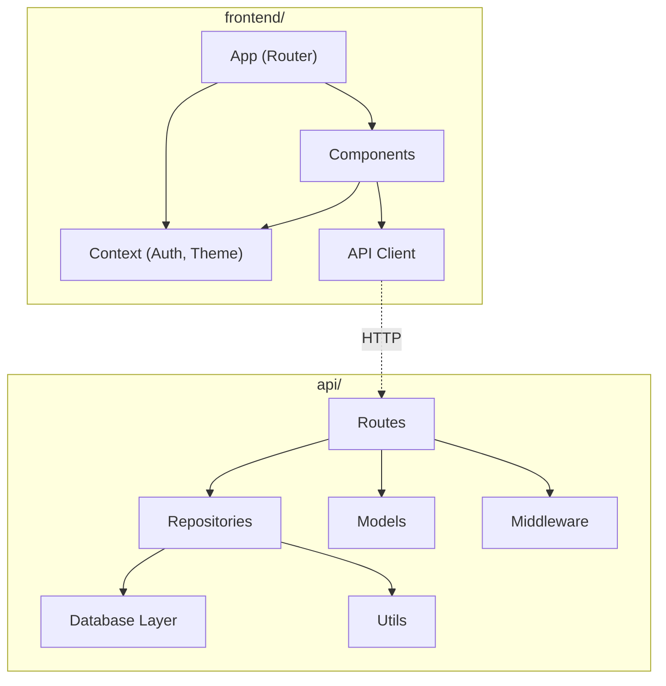

# Dependencies

## Internal Dependencies

### Frontend depends on API
- **Type**: Runtime (HTTP)
- **Reason**: Frontend consumes REST API endpoints via Axios

### Routes depend on Repositories
- **Type**: Compile
- **Reason**: Route handlers instantiate repository classes for DB operations

### Repositories depend on Database Layer
- **Type**: Compile
- **Reason**: Repositories receive `DatabaseConnection` for executing queries

### Repositories depend on Utils
- **Type**: Compile
- **Reason**: Use `buildInsertSQL`, `buildUpdateSQL`, `objectToCamelCase`, `handleDatabaseError`

### Routes depend on Models
- **Type**: Compile
- **Reason**: TypeScript interfaces for request/response typing

## External Dependencies

### express 5.2.1
- **Version**: 5.2.1 (pinned)
- **Purpose**: HTTP framework for API
- **License**: MIT

### better-sqlite3 ^12.11.1
- **Version**: ^12.11.1
- **Purpose**: SQLite driver for development and testing
- **License**: MIT

### pg ^8.13.1
- **Version**: ^8.13.1
- **Purpose**: PostgreSQL driver for production
- **License**: MIT

### react ^19.2.7
- **Version**: ^19.2.7
- **Purpose**: UI framework
- **License**: MIT

### @tanstack/react-query ^5.101.1
- **Version**: ^5.101.1
- **Purpose**: Async state management, caching
- **License**: MIT

### axios 1.8.1
- **Version**: 1.8.1 (pinned)
- **Purpose**: HTTP client for frontend-to-API communication
- **License**: MIT

### cors ^2.8.5
- **Version**: ^2.8.5
- **Purpose**: Cross-Origin Resource Sharing middleware
- **License**: MIT

### swagger-jsdoc ^6.3.0
- **Version**: ^6.3.0
- **Purpose**: Generate OpenAPI spec from JSDoc annotations
- **License**: MIT

### swagger-ui-express ^5.0.1
- **Version**: ^5.0.1
- **Purpose**: Serve Swagger UI at /api-docs
- **License**: MIT

### tailwindcss ^4.2.2
- **Version**: ^4.2.2
- **Purpose**: Utility-first CSS framework
- **License**: MIT

### react-router-dom ^7.18.0
- **Version**: ^7.18.0
- **Purpose**: Client-side routing
- **License**: MIT

### vite 8.1.0
- **Version**: 8.1.0 (pinned)
- **Purpose**: Frontend dev server and bundler
- **License**: MIT

### vitest ^4.0.10 / 4.1.9
- **Version**: ^4.0.10 (API), 4.1.9 (Frontend)
- **Purpose**: Test runner
- **License**: MIT

### typescript ^6.0.3
- **Version**: ^6.0.3
- **Purpose**: Type-safe JavaScript compilation
- **License**: Apache-2.0
